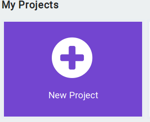

### Wprowadzenie do makecode

__MakeCode__ to edytor tworzony przez Microsoft, który pomaga w progamowaniu min. micro:bit za pomocą bloczków oraz 
JavaScriptu. 

Posiada on intuicyjny panel, dzięki czemu każdy początkujący użytkownik będzie w stanie się w nim sprawnie poruszać. 

Zacznijmy od zabawy z naszym prostym projektem. Klikamy w ikonkę 

##### Hello World MakeCode!
Będzie to proste wyświetlanie napisu: "Hello World" 
